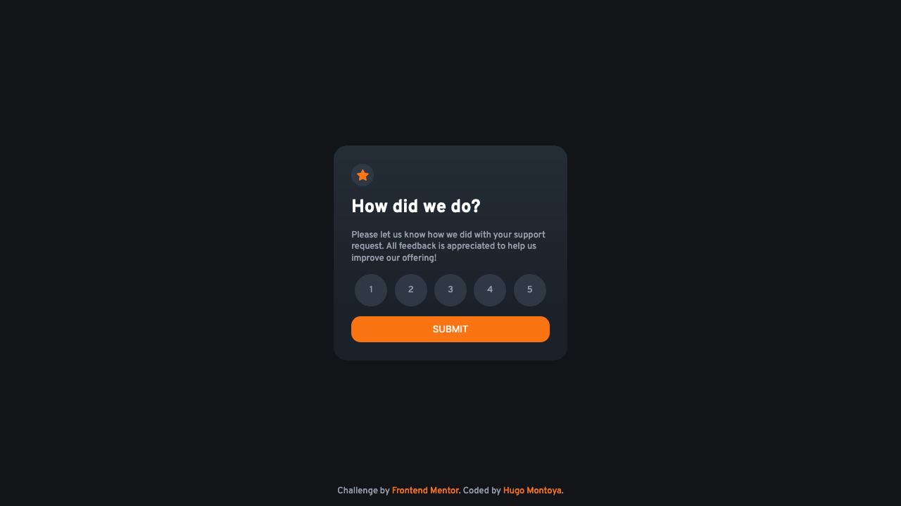

# Frontend Mentor - Interactive rating component solution

This is a solution to the [Interactive rating component challenge on Frontend Mentor](https://www.frontendmentor.io/challenges/interactive-rating-component-koxpeBUmI). Frontend Mentor challenges help you improve your coding skills by building realistic projects. 

## Table of contents

- [Overview](#overview)
  - [The challenge](#the-challenge)
  - [Screenshot](#screenshot)
  - [Links](#links)
- [My process](#my-process)
  - [Built with](#built-with)
  - [What I learned](#what-i-learned)
  - [Continued development](#continued-development)
  - [Useful resources](#useful-resources)
- [Author](#author)
- [Acknowledgments](#acknowledgments)

**Note: Delete this note and update the table of contents based on what sections you keep.**

## Overview

### The challenge

Users should be able to:

- View the optimal layout for the app depending on their device's screen size
- See hover states for all interactive elements on the page
- Select and submit a number rating
- See the "Thank you" card state after submitting a rating

### Screenshot



### Links

- Solution URL: [My solution](https://your-solution-url.com)
- Live Site URL: [Solution Page](https://your-live-site-url.com)

## My process

### Built with

- Semantic HTML5 markup
- CSS custom properties
- Flexbox
- CSS functions
- Mobile-first workflow

### What I learned

Althought, I think the JavaScript file code could use of important improvements, this challenge is helpfull to learn about DOM Manipulation: how to get components from de DOM, extract their data and modify them.

Because I choose not to embed the JavasScript code in the HTML, I needed to use events and EventListeners and Events to be able to add my functionality. 

This is for example how I dealt with the rating display to make the button values listen to the user click:

```html
<form class="rating-form">
          <div class="rating-values">
            <div class="rating-value-wrap">
              <label class="rating-number" for="rating-1">1</label> 
              <input class="radio" id="rating-1" type="radio" name="rating" value="1">
            </div>
            
            <div class="rating-value-wrap">
              <label class="rating-number" for="rating-2">2</label> 
              <input class="radio" id="rating-2" type="radio" name="rating" value="2">
            </div>
            
            <div class="rating-value-wrap">
              <label class="rating-number" for="rating-3">3</label> 
              <input class="radio" id="rating-3" type="radio" name="rating" value="3">
            </div>
            
            <div class="rating-value-wrap">
              <label class="rating-number" for="rating-4">4</label> 
              <input class="radio" id="rating-4" type="radio" name="rating" value="4">
            </div>
            
            <div class="rating-value-wrap">
              <label class="rating-number" for="rating-5">5</label> 
              <input class="radio" id="rating-5" type="radio" name="rating" value="5">
            </div>
            
          </div>
          <button class="card-btn" type="submit">Submit</button>
        </form>
```


```js
const rateValue = document.getElementsByName('rating');
    rateValue.forEach((input) => {
        input.addEventListener("click", activate);
    })
```

### Useful resources

- [JavaScript Events, MDN](https://developer.mozilla.org/en-US/docs/Learn/JavaScript/Building_blocks/Events) - You can find here a nice explanation about events.
- [JavaScript AddEventListener, MDN](https://developer.mozilla.org/en-US/docs/Web/API/EventTarget/addEventListener) - The same but for listeners


## Author

- Frontend Mentor - [@Gugor](https://www.frontendmentor.io/profile/Gugor)


## Acknowledgments

Thanks to Fontend Mentor to give access to this challenge, and for free!

